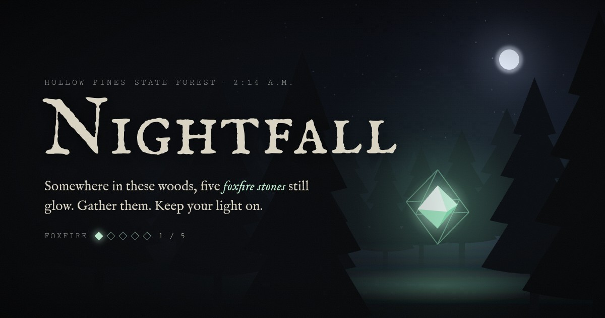
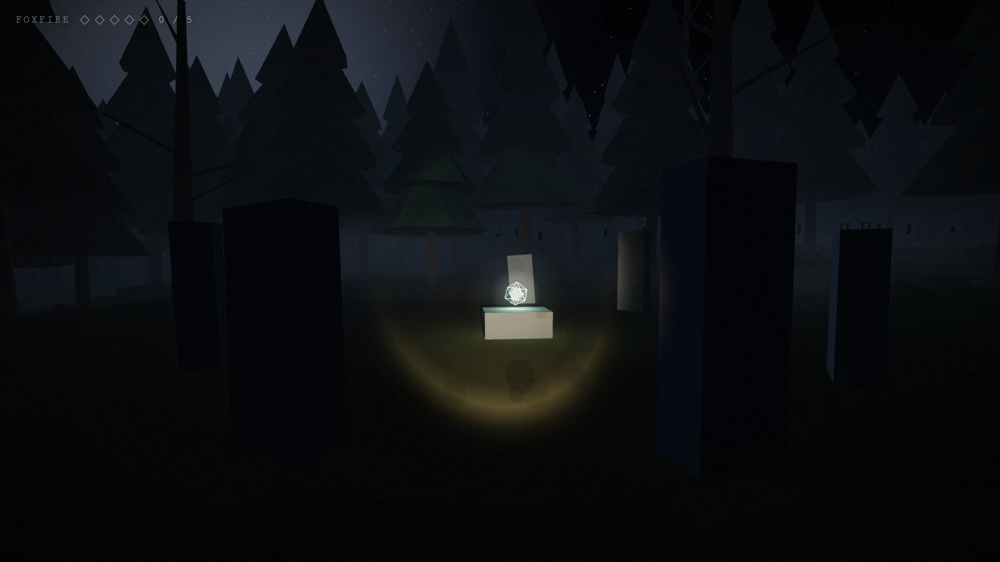
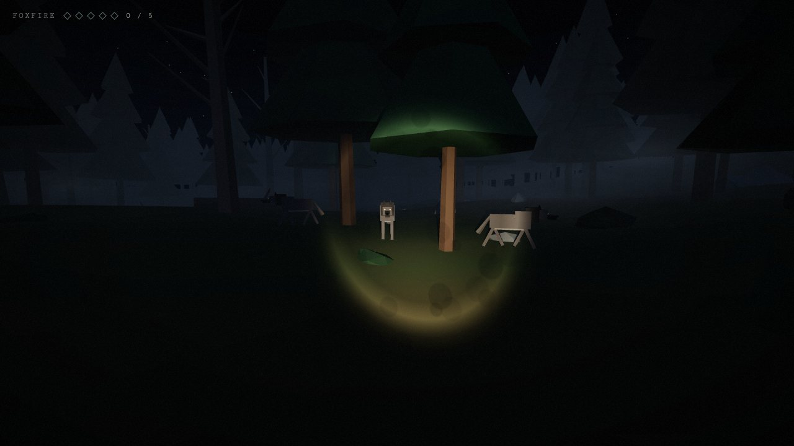
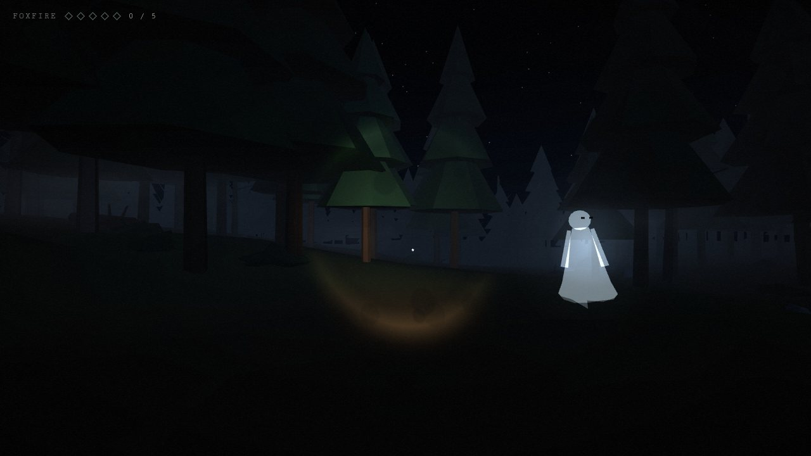
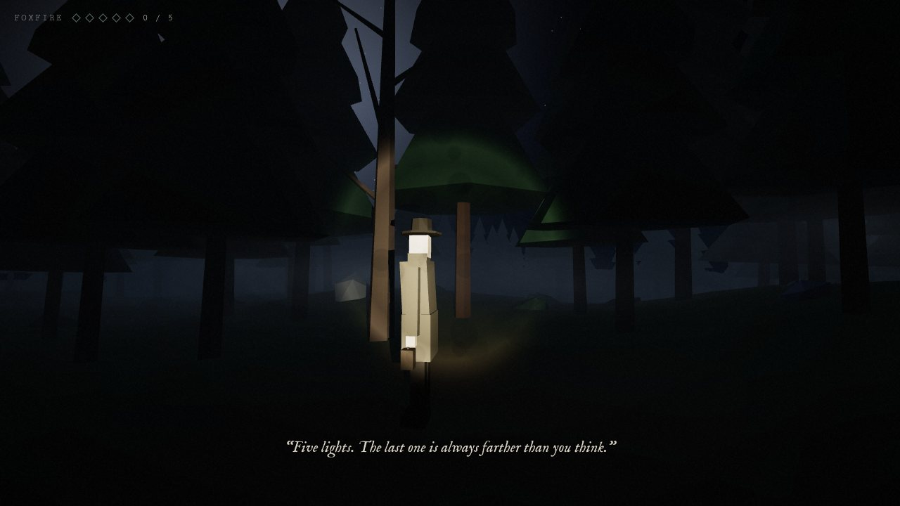
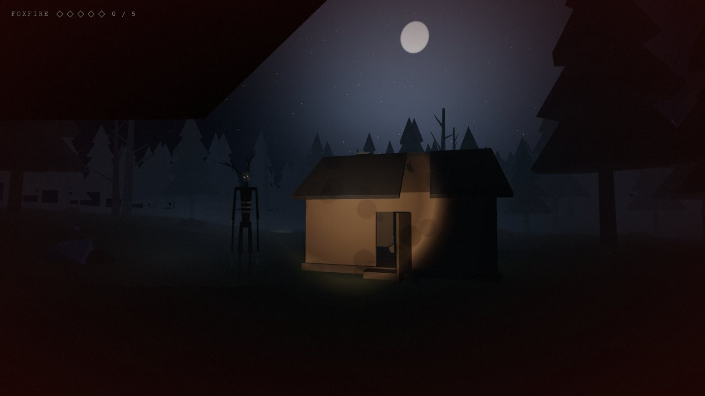

# Nightfall

A first-person horror game set in a foggy forest at night. Find five glowing foxfire stones to escape before the tall one reaches you. It runs in the browser, and everything is built from simple geometry with synthesized audio. There's no build step and no asset files.

**[Play it in your browser →](https://miguelsolorio.github.io/nightfall/)** Headphones recommended.



## Demo

<a href="docs/demo.mp4"></a>

A 30-second tour recorded in the game, with the encounters staged for the camera. [Watch it as a video](docs/demo.mp4) for full quality.

## How to play

Your car died at the trailhead. Somewhere in the woods, five **foxfire stones** still glow. Collect all five and the way out opens. Look for their glow through the fog, and listen for the hum when you're close.

| Keyboard and mouse | Touch | Action |
| --- | --- | --- |
| <kbd>W</kbd> <kbd>A</kbd> <kbd>S</kbd> <kbd>D</kbd> | Drag on the left side | Walk |
| Mouse (click to capture it) | Drag on the right side | Look around |
| <kbd>Shift</kbd> | Push the stick past its ring | Run |
| <kbd>F</kbd> | Flashlight button | Flashlight on / off |
| <kbd>Esc</kbd> | Pause button | Pause |

On phones and tablets the game goes fullscreen where the browser allows it. It's best played sideways.

- **Stamina.** Running drains your breath (the bar at the bottom of the screen). Run it dry and you're stuck walking until you recover.
- **Flashlight.** It's your main light, and it flickers sometimes, more often when something is near. Many things in the forest react to it.
- **Dread.** A low drone, a heartbeat and a red edge creep in when something dangerous is close.

## What's in the woods

<table>
  <tr>
    <td width="50%"></td>
    <td width="50%"></td>
  </tr>
  <tr>
    <td><b>Foxfire stones</b>: five of them, hidden near the forest's landmarks.</td>
    <td><b>Wolves</b> circle you at a distance and growl. Charge one or hold your light on it and it backs off.</td>
  </tr>
  <tr>
    <td></td>
    <td></td>
  </tr>
  <tr>
    <td><b>Ghosts</b> drift toward you, whispering. Catch one in your beam and it dissolves. If one reaches you, it takes your breath.</td>
    <td><b>The wanderer</b> is lost too. He has one thing to say to you.</td>
  </tr>
</table>

**Deer and owls** are harmless. They bolt or take flight when you get close or shine a light on them.

**The tall one** follows a few rules:



- It only moves while you aren't watching it: behind you, behind the trees, or whenever your light is off or flickering.
- You only ever glimpse it at the edge of your beam. Point the beam straight at it and it's gone, for a while.
- It gets faster with every stone you find.
- If it reaches you, the game is over.

## Run it locally

The game uses ES modules, so it needs to be served over HTTP. Opening `index.html` directly won't work.

```bash
python3 -m http.server 8000 -d public
```

Then open <http://localhost:8000>. Add `?debug` to the URL (or press <kbd>`</kbd>) for an FPS and draw-call readout.

## Deploying

Every push to `main` deploys `public/` to GitHub Pages through [`.github/workflows/pages.yml`](.github/workflows/pages.yml). Before the first deploy, set **Settings → Pages → Build and deployment → Source** to **GitHub Actions**.

## Project layout

```
public/
  index.html          markup, and the import map that loads Three.js from cdnjs
  styles.css          HUD, menus, and overlay effects
  src/
    main.js           frame loop and wiring
    world.js          terrain, instanced forest, landmarks, collision
    player.js         movement, stamina, footsteps
    touch.js          on-screen stick and buttons for phones and tablets
    flashlight.js     beam, flicker, and "is this lit?" checks
    audio.js          all sound, synthesized with the Web Audio API
    relics.js         the foxfire stones
    game.js           start / pause / restart, win and lose
    creatures/        deer, owls, wolves, ghosts, the wanderer, the tall one
```

Built with [Three.js](https://threejs.org/) r186.
